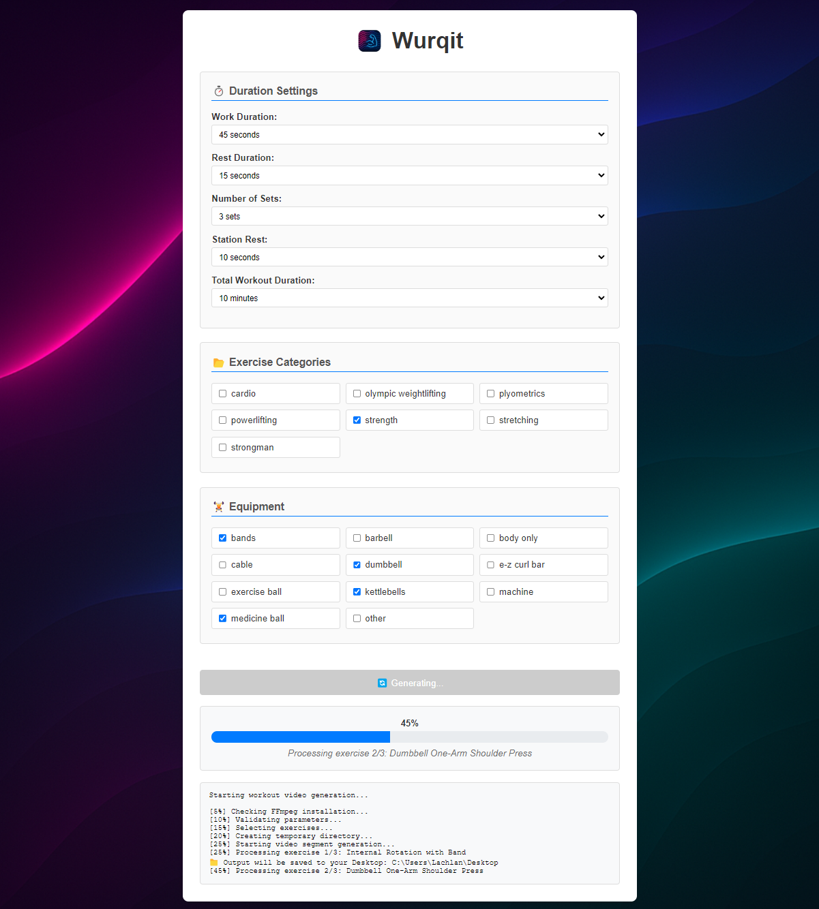

# 💪 Wurqit: Workout Video Generator 🏋️

<div align="center">
     
</div>

Wurqit is your ultimate desktop workout video generator — built for fitness enthusiasts who want total control over their routines without the hassle.

Available on macOS, Windows, and Linux, Wurqit lets you create fully customized workout videos using a powerful, built-in library of over 800 high-quality exercise clips. Whether you're training for strength, cardio, or core — with dumbbells, resistance bands, or just bodyweight — Wurqit adapts to you.

Just set your:

    ✅ Work and rest intervals
    ✅ Time between stations
    ✅ Sets per station
    ✅ Total workout duration
    ✅ Equipment on hand
    ✅ Preferred training style

…and Wurqit automatically generates a custom video workout that looks great and feels like it was made just for you.

No subscriptions. No setup. No internet required. Just launch the app and start moving.



# Quick start

Download the installer for your operating system from the releases tab in this repo. After downloading it to your computer, run the installer to install it on your computer.

# Options available

1. Work time (e.g. 45 seconds work)
2. Rest time (e.g. 15 seconds rest)
3. Time between stations (e.g. 15 seconds to get ready)
4. Number of sets per station (e.g. 3 sets)
5. Total workout time (e.g. 60 minutes)
6. Type of workout (e.g. strength,cardio)
7. Equipment (e.g. kettlebell,dumbell,bands)

# Developers guide

## Introduction

This is an Electron desktop application. All dependencies are bundled with the application, so the end user doesn't need to install additional software (such as FFmpeg) or provide exercise videos.

## File/folder structure of important files/folders

```
 - workout-generator
    - media
        - audio     | contains audio for exercise videos
        - icon      | contains icon files for the app
        - videos    | contains all the exercise videos
        - images    | contains images for the app
    - tests         | contains tests for the main app code
    - .env          | the environment variables used for builds
    - generator.js  | the main JS for generating the videos
    - index.html    | the UI of the app
    - main.js       | the entry point of the app
    - notarize.js   | used to notarize the app for release
    - package.json  | npm packages file, contains build config too
    - preload.js    | used to preload all the IPC code
```

## Run it locally

Run the following commands

`yarn install`

`yarn start`

## Testing

Run the test suite with Jest:

```bash
npm test
```

Run tests in watch mode:

```bash
npm run test:watch
```

Run tests with coverage:

```bash
npm test -- --coverage
```

See the [tests/README.md](tests/README.md) for detailed testing information.

## Build for release

You will need to create an `.env` file in the root of the repo with the following contents

```
APPLE_APP_SPECIFIC_PASSWORD=...
APPLE_TEAM_ID=...
APPLE_ID=...
```

Provide your own values in place of `...`

Then run

`yarn build`

# Exercise data source

https://github.com/yuhonas/free-exercise-db
