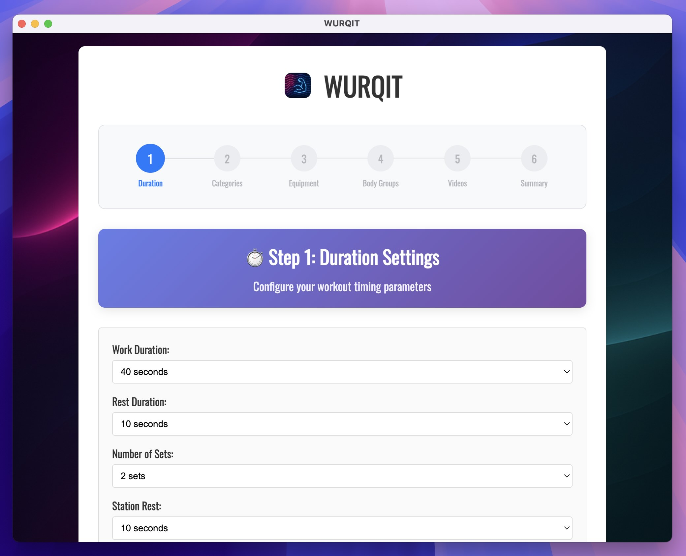
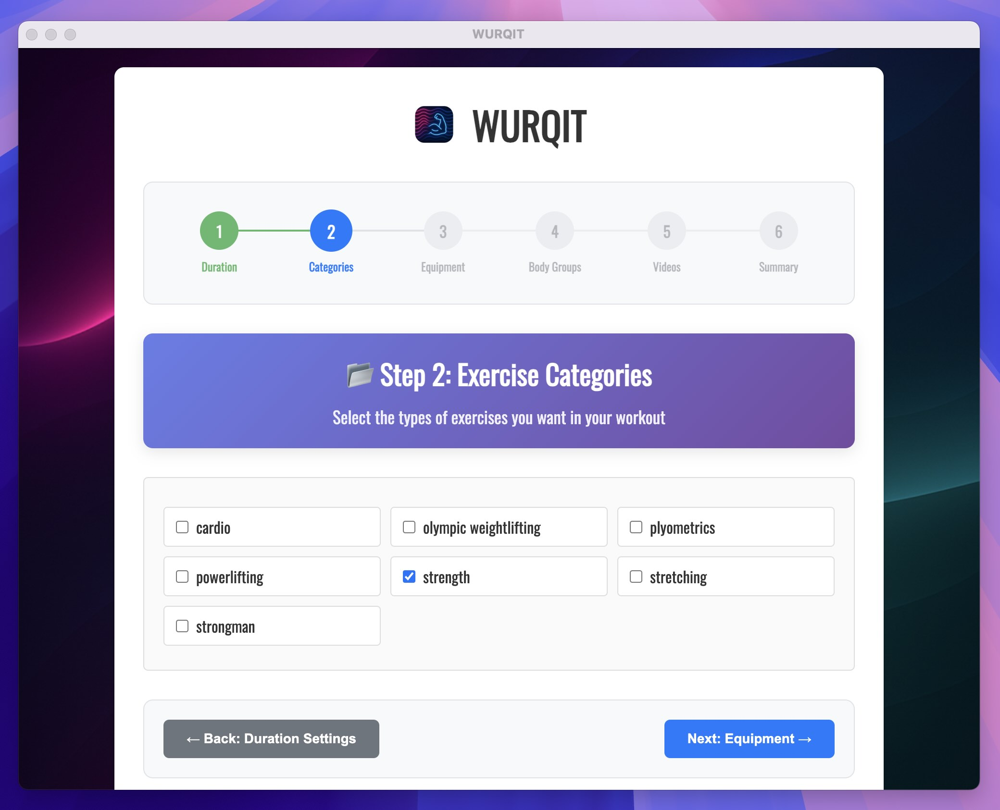
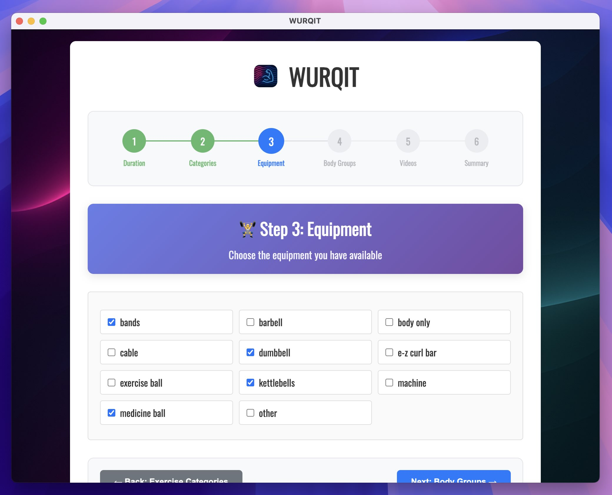
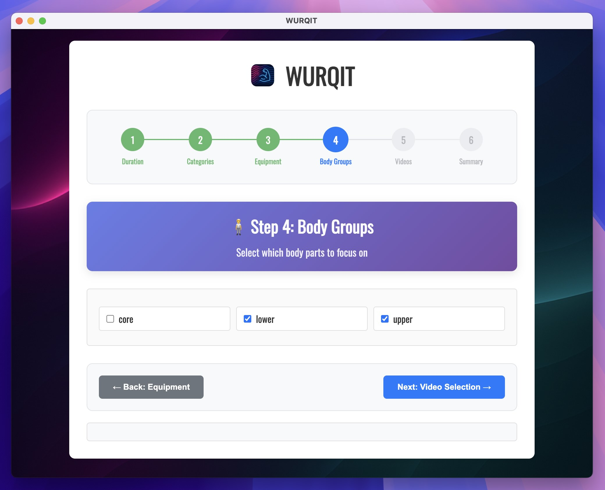
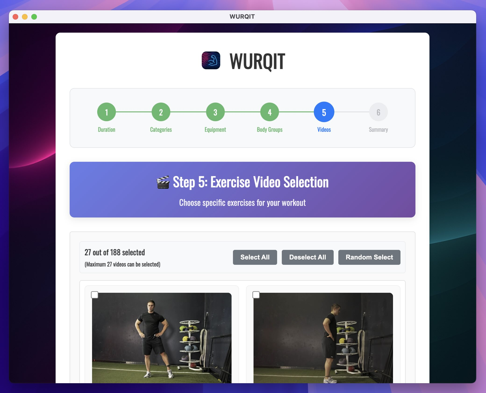
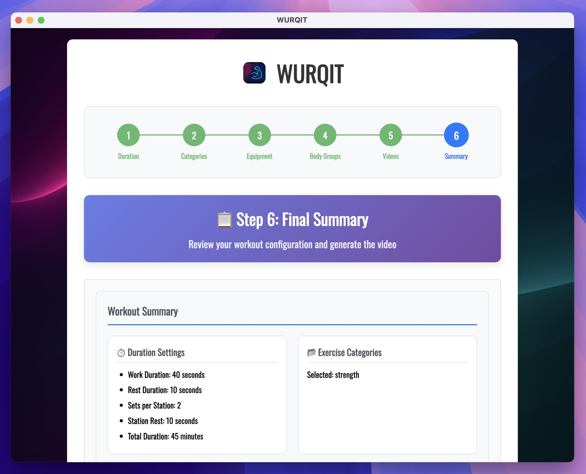
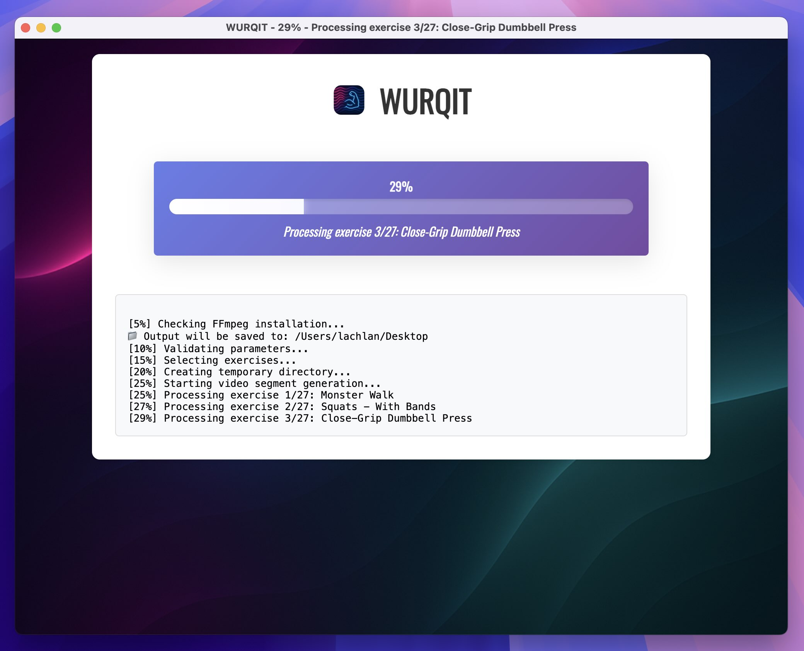
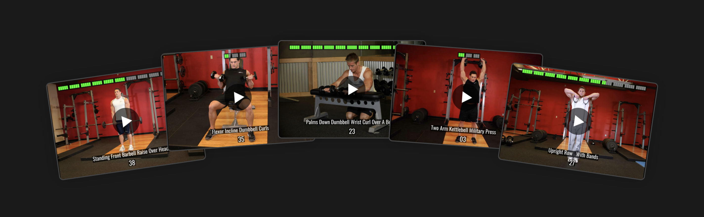

# 💪 Wurqit: Workout Video Generator 🏋️


[](https://github.com/lachlanwp/wurqit/actions/workflows/tests.yml)

Wurqit is your ultimate desktop workout video generator — built for fitness enthusiasts who want total control over their routines without the hassle.

Available on macOS, Windows, and Linux, Wurqit lets you create fully customized workout videos using a powerful, built-in library of over 800 high-quality exercise clips. Whether you're training for strength, cardio, or core — with dumbbells, resistance bands, or just bodyweight — Wurqit adapts to you.

Just set your:

    ✅ Work and rest intervals
    ✅ Time between stations
    ✅ Sets per station
    ✅ Total workout duration
    ✅ Equipment on hand
    ✅ Preferred training style

…and Wurqit automatically generates a custom video workout that looks great and feels like it was made just for you.

No subscriptions. No setup. No internet required. Just launch the app and start moving.

# Easy to use UI









# Professional videos



# Quick start

Download the installer for your operating system from the releases tab in this repo. After downloading it to your computer, run the installer to install it on your computer

# Options available

1. Work time (e.g. 45 seconds work)
2. Rest time (e.g. 15 seconds rest)
3. Time between stations (e.g. 15 seconds to get ready)
4. Number of sets per station (e.g. 3 sets)
5. Total workout time (e.g. 60 minutes)
6. Type of workout (e.g. strength,cardio)
7. Equipment (e.g. kettlebell,dumbell,bands)

# Developers guide

## Introduction

This is an Electron desktop application. All dependencies are bundled with the application, so the end user doesn't need to install additional software (such as FFmpeg) or provide exercise videos.

## Development environment

You will need the following installed on your dev system

- Node 20+
- Yarn
- Git

## File/folder structure of important files/folders

```
 - workout-generator
    - media
        - audio     | contains audio for exercise videos
        - icon      | contains icon files for the app
        - videos    | contains all the exercise videos
        - images    | contains images for the app
    - tests         | contains tests for the main app code
    - .env          | the environment variables used for builds
    - src/
        - generator.ts  | the main TypeScript for generating the videos
        - main.ts       | the entry point of the app
        - preload.ts    | used to preload all the IPC code
        - script.ts     | the UI logic of the app
    - index.html    | the UI of the app
    - notarize.js   | used to notarize the app for release
    - package.json  | npm packages file, contains build config too
```

## Run it locally

Run the following commands

```bash
yarn install
```

```bash
yarn start
```

## Testing

Run the test suite with Jest:

```bash
yarn test
```

Run tests in watch mode:

```bash
yarn test:watch
```

Run tests with coverage:

```bash
yarn test -- --coverage
```

See the [tests/README.md](tests/README.md) for detailed testing information.

## Continuous Integration

This project uses GitHub Actions for continuous integration:

- **Tests**: Automatically runs on every push to `main` and pull request
- **Node.js Versions**: Tests against Node.js 18.x and 20.x
- **Coverage**: Generates coverage reports for each test run
- **Artifacts**: Coverage reports are saved as build artifacts

The test badge above shows the status of the latest test run on the main branch. The badge will appear after the first push to the main branch triggers the GitHub Actions workflow.

## Build for release

You will need to create an `.env` file in the root of the repo with the following contents

```
APPLE_APP_SPECIFIC_PASSWORD=...
APPLE_TEAM_ID=...
APPLE_ID=...
```

Provide your own values in place of `...`

Then run

```bash
yarn build
```

# Privacy policy

None of your data is stored or transmitted. We don't collection signups/logins and we don't use any analytics tracking. This app doesn't 'dial home' in anyway.

# Terms and conditions

THE SOFTWARE IS PROVIDED “AS IS”, WITHOUT WARRANTY OF ANY KIND, EXPRESS OR IMPLIED, INCLUDING BUT NOT LIMITED TO THE WARRANTIES OF MERCHANTABILITY, FITNESS FOR A PARTICULAR PURPOSE AND NONINFRINGEMENT. IN NO EVENT SHALL THE AUTHORS OR COPYRIGHT HOLDERS BE LIABLE FOR ANY CLAIM, DAMAGES OR OTHER LIABILITY, WHETHER IN AN ACTION OF CONTRACT, TORT OR OTHERWISE, ARISING FROM, OUT OF OR IN CONNECTION WITH THE SOFTWARE OR THE USE OR OTHER DEALINGS IN THE SOFTWARE.

# Exercise data source

https://github.com/yuhonas/free-exercise-db
