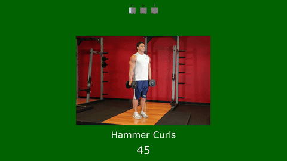

# 💪 Workout Generator 🏋️

Generates a workout based on your inputs

# Requirements

Must be on a \*nix

The script requires the following software to be installed on the host OS:

1. FFmpeg – for video and audio processing (used extensively throughout the script).
2. ffprobe – for getting video duration (part of the FFmpeg suite).
3. awk, sed, basename, find, mktemp, cat, rm – standard Unix command-line utilities (usually pre-installed on macOS and Linux).

If you are running on macOS or Linux, you mainly need to ensure FFmpeg (which includes ffprobe) is installed. The script provides installation hints for FFmpeg for macOS (brew install ffmpeg), Ubuntu/Debian (sudo apt install ffmpeg), and CentOS/RHEL (sudo yum install ffmpeg).

# Setup

Make sure `generate.sh` is executable, run `chmod +x generate.sh`.

# How to use?

Run the following command in the terminal, from the repo directory:

`generate.sh`

Follow the prompts to customise your workout.

Once done, a new MP4 video will be saved for you.

# Further enhancements

Body group & equipment selections 🚀

# Excercise data source?

https://github.com/yuhonas/free-exercise-db
